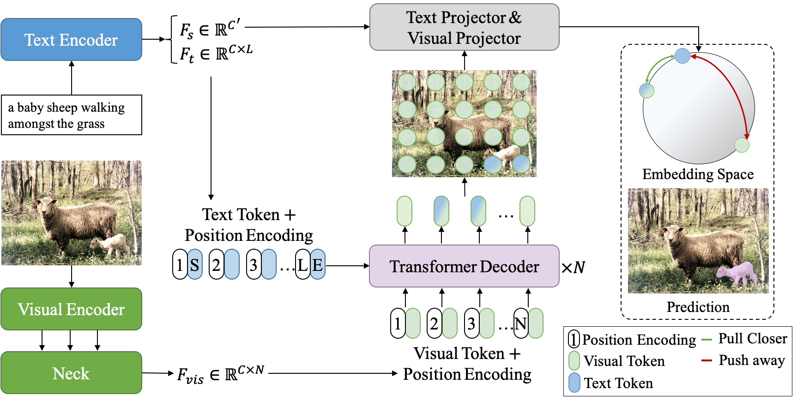

# CRIS: CLIP-Driven Referring Image Segmentation

Created by Zhaoqing Wang*, Yu Lu*, Qiang Li*, Xunqiang Tao, Yandong Guo, Mingming Gong and Tongliang Liu

This is an official PyTorch implementation of the [CRIS](https://arxiv.org/pdf/2111.15174)

CLIP-Driven Referring Image Segmentation (CRIS) framework is proposed to transfer the image-level semantic  knowledge of the CLIP model to dense pixel-level referring image segmentation. More specifically, we design a vision-language decoder to propagate fine-grained semantic information from textual representations to each pixel-level activation, which promotes consistency between the two modalities. In addition, we present text-to-pixel contrastive learning to explicitly enforce the text feature similar to the related pixel-level features and dissimilar to the irrelevances.

**:beers:CRIS actives new state-of-the-art performance on RefCOCO, RefCOCO+ and G-Ref with simple framework!**

## Framework
<p align="center">
  
</p>

## News
- :wrench: [Jun 6 ,2022] Pytorch implementation of CRIS are released.
- :sunny: [March 2 ,2022] Our paper was accepted by CVPR-2022.


## Main Results

Main results on RefCOCO

| Backbone | val | test A | test B |
| ---- |:-------------:| :-----:|:-----:|
| ResNet50 | 69.52  | 72.72 | 64.70 |
| ResNet101 | 70.47 | 73.18 | 66.10 |

Main results on RefCOCO+

| Backbone | val | test A | test B |
| ---- |:-------------:| :-----:|:-----:|
| ResNet50 | 61.39 |67.10 | 52.48 |
| ResNet101 | 62.27 | 68.08 | 53.68 |

Main results on RefCOCO+

| Backbone | val | test |
| ---- |:-------------:| :-----:|
| ResNet50 | 59.35 | 59.39 |
| ResNet101 | 59.87 | 60.36 |

## Preparation

1. Environment
   - [PyTorch](www.pytorch.org) (e.g. 1.10.0)
   - Other dependencies in `requirements.txt`
2. Datasets
   - The detailed instruction is in [prepare_datasets.md](tools/prepare_datasets.md)

## Quick Start

This implementation only supports **multi-gpu**, **DistributedDataParallel** training, which is faster and simpler; single-gpu or DataParallel training is not supported. Besides, the evaluation only supports single-gpu mode.

To do training of CRIS with 8 GPUs, run:

```
# e.g., Evaluation on the val-set of the RefCOCO dataset
python -u train.py --config config/refcoco/cris_r50.yaml
```

To do evaluation of CRIS with 1 GPU, run:
```
# e.g., Evaluation on the val-set of the RefCOCO dataset
CUDA_VISIBLE_DEVICES=0 python -u test.py \
      --config config/refcoco/cris_r50.yaml \
      --opts TEST.test_split val-test \
             TEST.test_lmdb datasets/lmdb/refcocog_g/val.lmdb
```

## License

This project is under the MIT license. See [LICENSE](LICENSE) for details.

## Citation
If you find our work useful in your research, please consider citing:
```
@inproceedings{wang2021cris,
  title={CRIS: CLIP-Driven Referring Image Segmentation},
  author={Wang, Zhaoqing and Lu, Yu and Li, Qiang and Tao, Xunqiang and Guo, Yandong and Gong, Mingming and Liu, Tongliang},
  booktitle={Proceedings of the IEEE/CVF conference on computer vision and pattern recognition},
  year={2022}
}
```
